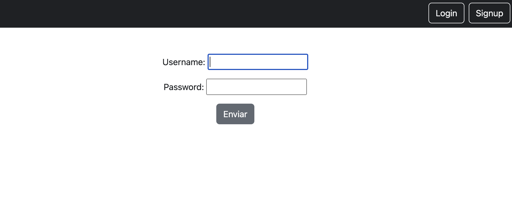
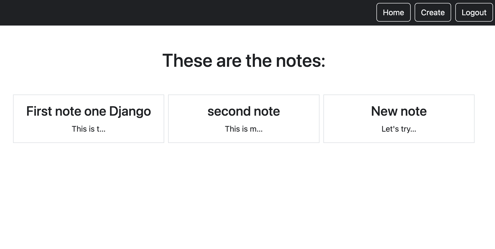

<!-- PROJECT TITLE -->
<br />
<div align="center">

<h2 align="center">DJANGO ESSENTIAL TRAINING</h3>
<p align="center"> Linkedin course offered by Leticia Portella </p>
<br />
</div>
<br/>

## About the project

This is my first project in Python. I've followed Leticia Portella's course in LinkedIn.

This course teaches fundamentals, such as what a framework is, what an HTTP request is, and how Django replies to HTTP requests.

It teaches how to build a working system that can create, edit, and list notes per user with an authentication system.

Topics include getting started, creating users and data, ORMs, creating a dynamic template, Django class-based files and static views.

<br/><br/>

## Description





<h5>The first image shows a login screen with Login and Signup buttons in the navbar. The second image shows the notes list with the Home, Create and Logout buttons. Selecting a note redirects the user to the detail view where it can be updated or deleted.</h5>

<br/><br/>

## Built with

Major frameworks/libraries used:

  

  

<br/><br/>

## What's included

The structure of the project is as follows:

```
home/
├── migrations/
├── templates/
│   └── home/
│       ├── login.html
│       ├── logout.html
│       ├── register.html
│       └── welcome.html
├── _init_.py
├── admin.py
├── apps.py
├── models.py
├── tests.py
├── urls.py
└── views.py

notes/
├── migrations/
├── templates/
│   └── notes/
│       ├── notes_delete.html
│       ├── notes_detail.html
│       ├── notes_form.html
│       └── notes_list.html
├── _init_.py
├── admin.py
├── apps.py
├── forms.py
├── models.py
├── tests.py
├── urls.py
└── views.py

smartnotes/
├── _init_.py
├── admin.py
├── asgi.py
├── settings.py
├── urls.py
└── wsgi.py

static/
├── css/
│   └── style.css
└── templates/
    └── base.html

```

<br/><br/>

## Author

I'm Marta Boteller, little more about me at my [website](https://martaboteller.com).
<br/> <br/>

## Acknowledgments

<p>I would like to thank <a href="https://www.linkedin.com/learning/instructors/leticia-portella"> Patricia Portella </a> for his fantastic way of teaching! </p>
